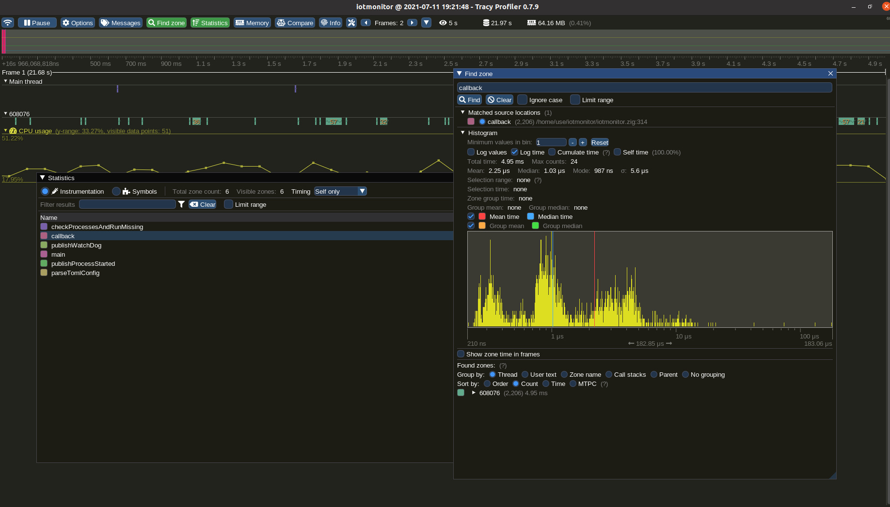

# Using Tracy to check performances

## Ubuntu 20, 

### Install tracy library dependencies

	apt install libglfw3-dev libgtk-3-dev libcapstone-dev libtbb-dev

	cd tracy

	make -j -C profiler/build/unix debug release

	make -j -C library/unix debug release

To launch iotmonitor with tracing, 

be sure the library path contains the tracy library

	export LD_LIBRARY_PATH=tracy/library/unix

launch iotmonitor, and Tracy, 

